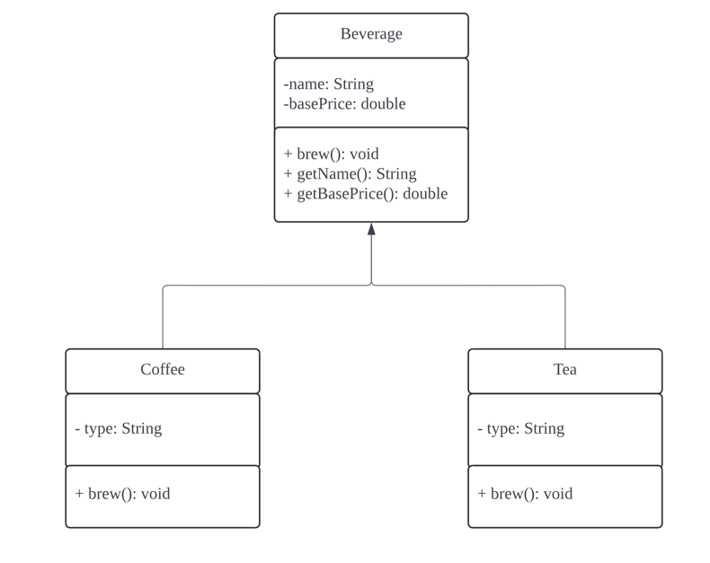

| CS-665       | Software Design & Patterns         |
|--------------|------------------------------------|
| Name         | Qiong Wang                         |
| Date         | 12/02/2024                         |
| Course       | Fall                               |
| Assignment # | Class Project: Order State Manager |

# Assignment Overview

This project, **Order State Manager**, is part of CS-665: Software Designs and Patterns. The objective is to implement a **Memento Pattern** to manage and restore the states of an order system. The Memento Pattern is demonstrated by creating a system that allows saving and restoring the state of an order, including product details, logistics, and promotions.

The project implements the following key components:

1. **Order**: Represents an order, including its products, logistics, promotions, and total price.
2. **OrderMemento**: Captures the state of an order and allows it to be restored later.
3. **OrderCaretaker**: Manages a history of mementos, allowing users to save and restore order states.

### Key Requirements:
1. Implement the **Memento Pattern** to allow saving and restoring order states.
2. Create unit tests (3-5 JUnit tests) to verify the functionality of the Memento Pattern.
3. Document the design decisions and explain how the Memento Pattern enables state management.

# GitHub Repository Link:
[https://github.com/QiongWang1/CS665_Project_OrderStateManager]()

# Implementation Description

The **Order State Manager** project implements the **Memento Pattern** to manage and restore the states of an order system. The `OrderCaretaker` acts as the manager for saving and restoring the states, while the `OrderMemento` class captures the state of an order.

### Key Components:
1. **Order**: Represents the order, including details such as products, logistics, promotions, and total price.
    - **Methods**:
        - `saveToMemento()`: Saves the current state of the order into a memento.
        - `restoreFromMemento(memento)`: Restores the order's state from the given memento.
2. **OrderMemento**: Captures the state of an order for saving and restoring.
3. **OrderCaretaker**: Manages the mementos, allowing users to save and restore the order's state history.

---

## Design Pattern:

This project applies the **Memento Pattern**, a behavioral design pattern that allows capturing and restoring an object's internal state without exposing its implementation details.

1. **Memento Pattern**:
    - **Participants**:
        - **Originator** (`Order`): Creates and uses mementos to save and restore its state.
        - **Memento** (`OrderMemento`): Stores the state of the originator in a format that cannot be altered by external classes.
        - **Caretaker** (`OrderCaretaker`): Manages mementos and provides restoration of states when required.
    - **Key Features**:
        - Enables undo/redo functionality.
        - Decouples state-saving logic from the rest of the system.
        - Preserves encapsulation by hiding the details of the saved state.

---

## System Flow:

1. The `Order` class creates a memento of its current state using `saveToMemento()`.
2. The `OrderCaretaker` saves this memento in its history, providing sequential state management.
3. The state can be restored at any time by retrieving a memento from the caretaker using `restore(index)` and passing it back to the `Order` class through `restoreFromMemento()`.
4. The history size is dynamically managed by the `OrderCaretaker`, allowing iterative saving and restoration.

### Example System Flow:
1. **Save Initial State**:
    - An order is created with products, logistics, and promotions.
    - Its state is saved into a memento and stored by the caretaker.
2. **Modify State**:
    - The order's products or logistics are updated.
    - The updated state is saved as another memento.
3. **Restore State**:
    - The caretaker retrieves the required state by index.
    - The order restores its state using the retrieved memento.

---

## Unit Tests:

1. **testSaveAndRestoreState()**:
    - Validates that the state saved in the memento matches the state restored later.
    - Ensures no data loss or alteration during state restoration.

2. **testMultipleStates()**:
    - Confirms that multiple states can be saved sequentially.
    - Ensures restoration to specific states by index is accurate.

3. **testInvalidRestore()**:
    - Tests edge cases like restoring a non-existent index.
    - Ensures the system handles errors gracefully with exceptions.

4. **testDynamicUpdates()**:
    - Tests state-saving after dynamic updates to logistics, promotions, and product lists.
    - Verifies that the caretaker maintains an accurate history of all saved states.

5. **testHistorySize()**:
    - Confirms that the caretaker accurately tracks the number of saved mementos.

---

## Assumptions:

1. The order system supports:
    - Saving logistics, promotions, and product details.
    - Restoring the exact state captured in the memento.
2. **Memento Integrity**:
    - The memento object is immutable and cannot be altered after creation.
    - Only the `Order` class has access to its state through the memento.
3. **Caretaker Behavior**:
    - The caretaker maintains an accurate sequence of states in memory.
    - No memento is deleted unless explicitly programmed.

---

## Flexibility

This project is designed to support:

1. **Future Extensions**:
    - Add new attributes to the `Order` class (e.g., customer details, delivery dates).
    - Extend the `OrderMemento` class to handle new state elements.
2. **State Management**:
    - Maintain multiple independent order histories by creating multiple caretakers.
3. **System Integration**:
    - The memento pattern can be integrated with other design patterns like **Command** or **Observer** to build advanced features like event tracking or undo/redo systems.

---

## Simplicity & Understandability

1. **Separation of Concerns**:
    - `Order`: Encapsulates the core business logic.
    - `OrderMemento`: Encapsulates the saved state details.
    - `OrderCaretaker`: Manages the state history.
2. **Encapsulation**:
    - The internal structure of the `Order` is hidden from external classes.
3. **Ease of Maintenance**:
    - Adding new features only requires updates to specific classes without breaking existing functionality.

---

## Avoidance of Duplicated Code

- **Centralized State Management**:
    - All state-saving logic is centralized in `OrderMemento`.
- **Reusable Components**:
    - `OrderCaretaker` can manage any object implementing the memento pattern, enhancing reusability.

---

## Design Patterns Used

1. **Memento Pattern**:
    - Ensures safe state-saving and restoration.
    - Decouples the originator's state logic from the caretaker's management logic.

2. **Potential Enhancements**:
    - **Command Pattern**: To provide undo/redo functionality alongside memento restoration.
    - **Observer Pattern**: To notify other components when a state is restored.

---

# UML Class Diagram
![https://lucid.app/lucidchart/22a05d1e-967c-4818-a1ca-6e99cfba8bc7/edit?viewport_loc=1172%2C388%2C4199%2C2552%2C0_0&invitationId=inv_f012cd08-024c-4c23-b5c4-105e4735be23]



---

# Running JUnit Tests

### Steps to Run the JUnit Tests:

```bash
# Step 1: Clean and compile the project
mvn clean compile

# Step 2: Run the tests
mvn test
