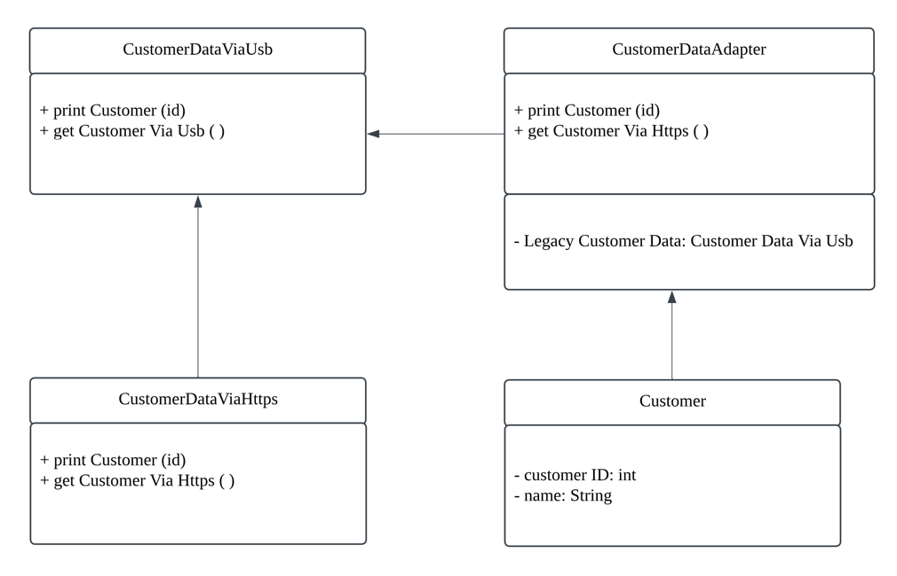

| CS-665       | Software Design & Patterns |
|--------------|--------|
| Name         | Qiong Wang |
| Date         | 11/10/2024 |
| Course       | Fall   |
| Assignment # | Hw4 Utilizing Legacy System       |

# Assignment Overview

This project is part of CS-665: Software Designs and Patterns. The objective is to integrate a modern system with a legacy customer data system that provides information through a USB interface. This project demonstrates the **Adapter Pattern** by creating an adapter class that enables the new system to communicate seamlessly with the legacy system.

The project implements the following key components:

1. **CustomerDataAdapter**: An adapter that enables the new email generation system to retrieve customer data from a legacy USB interface.
2. **MockCustomerDataUsb**: A mock implementation simulating the legacy data access via USB for testing purposes.
3. **Customer**: Represents customer information and is used to generate customized email content.

### Key Requirements:
1. Implement the **Adapter Pattern** to bridge the gap between the legacy system and the modern system.
2. Create unit tests (3-5 JUnit tests) to verify the functionality and integration of the adapter with the new system.
3. Document the design decisions and explain how the Adapter Pattern enables system integration.

# GitHub Repository Link:
[https://github.com/QiongWang1/CS665_Hw4](https://github.com/QiongWang1/CS665_Hw4)

# Implementation Description

This project implements an adapter class that integrates a legacy system with a modern email generation system. The adapter, **CustomerDataAdapter**, allows the new system to access customer data through the legacy USB-based interface, thereby maintaining compatibility without modifying the legacy code.

### Key Components:
1. **CustomerDataAdapter**: Implements the interface required by the new system and adapts it to the methods provided by the legacy system's USB interface.
   - **Methods**:
      - `getCustomerInfo()`: Retrieves customer data and adapts it to the new system format.
2. **MockCustomerDataUsb**: Simulates the legacy USB system to provide sample customer data. It is used to test the adapter without requiring the actual legacy hardware.
   - **Methods**:
      - `getCustomerViaUsb()`: Returns customer data for a given ID.
3. **Customer**: Represents customer data for use in email generation. It leverages the adapter to retrieve necessary information from the legacy system.

### Design Pattern:
This project applies the **Adapter Pattern** to integrate incompatible interfaces between the legacy and new systems.

1. **Adapter Pattern**:
   - The `CustomerDataAdapter` class serves as the adapter, translating the methods in `MockCustomerDataUsb` into a format usable by the new system. This enables seamless communication between the new and legacy systems without modifying the legacy codebase.

### System Flow:
1. The `CustomerDataAdapter` is initialized with a `MockCustomerDataUsb` instance.
2. The new system requests customer information through the adapter.
3. The adapter translates the request into a format compatible with the legacy system.
4. The legacy system returns data, which is formatted and provided to the new system by the adapter.

### Unit Tests:
- **testGetCustomerInfo()**: Verifies that the adapter correctly retrieves and formats customer data from the legacy system.
- **testNonExistentCustomer()**: Ensures that the adapter handles cases where a customer ID is not found.
- **testPrintCustomer()**: Checks that customer information is printed in the expected format.

### Assumptions:
- The legacy system is unmodifiable and must be accessed through a USB interface.
- The adapter acts as a bridge to maintain backward compatibility, allowing the new system to integrate smoothly.

## Flexibility
This project is designed for extensibility:
- **Adding New Legacy Interfaces**: The adapter can be extended to support other legacy interfaces by implementing new methods within `CustomerDataAdapter`.
- **Adding New Customer Attributes**: If the legacy system is updated, the adapter can be easily modified to map additional attributes.

## Simplicity & Understandability
The system is structured to clearly separate responsibilities, making it straightforward to understand and extend:
- **Single Responsibility**: Each class has a single responsibility, making it easy to maintain and extend.
- **Reusability**: By using the Adapter Pattern, the adapter class can be reused with other legacy interfaces that have similar requirements.

## Avoidance of Duplicated Code
This project follows the **DRY (Don't Repeat Yourself)** principle:
- **Centralized Adapter Logic**: The adapter centralizes the translation logic, avoiding the need for multiple classes to handle legacy data directly.
- **Reusable Components**: The adapter and legacy system classes are designed for reusability without duplicating code.

## Design Patterns Used
1. **Adapter Pattern**: Allows the new system to interface with the legacy system by providing a compatible interface.

### Other Potential Design Patterns:
1. **Facade Pattern**: This pattern could encapsulate additional complexity if there are multiple legacy systems, creating a unified interface for the new system.
2. **Factory Method**: Could be used in the future if there are multiple types of adapters for different legacy systems, enabling dynamic creation of specific adapters as needed.

# UML Class Diagram
[UML Diagram Link](https://lucid.app/lucidchart/67ae33e0-ee01-4576-8a3b-cce540ef42b7/edit?viewport_loc=42%2C64%2C1586%2C837%2C0_0&invitationId=inv_511cdf4d-cde3-4bad-9bb5-e5abda14441c)


# Running JUnit Tests

To verify the functionality of the system, JUnit tests have been implemented to test the core components of the project. These tests ensure that the adapter properly integrates with the legacy system and returns the expected results.

### Steps to Run the JUnit Tests:

1. **Compile the Project**:
   First, ensure the project is compiled. You can do this using Maven:
   ```bash
   mvn clean compile

2. **Run Tests**:
   To run the tests, execute the following Maven command:
   ```bash
   mvn test

# Maven Commands

This project uses Maven for building, compiling, and running tests. Below are the essential Maven commands that you can use to manage the project:

### 1. Compile the Project

To compile the project and ensure that the source code is error-free, run the following command:

```bash
mvn clean compile
