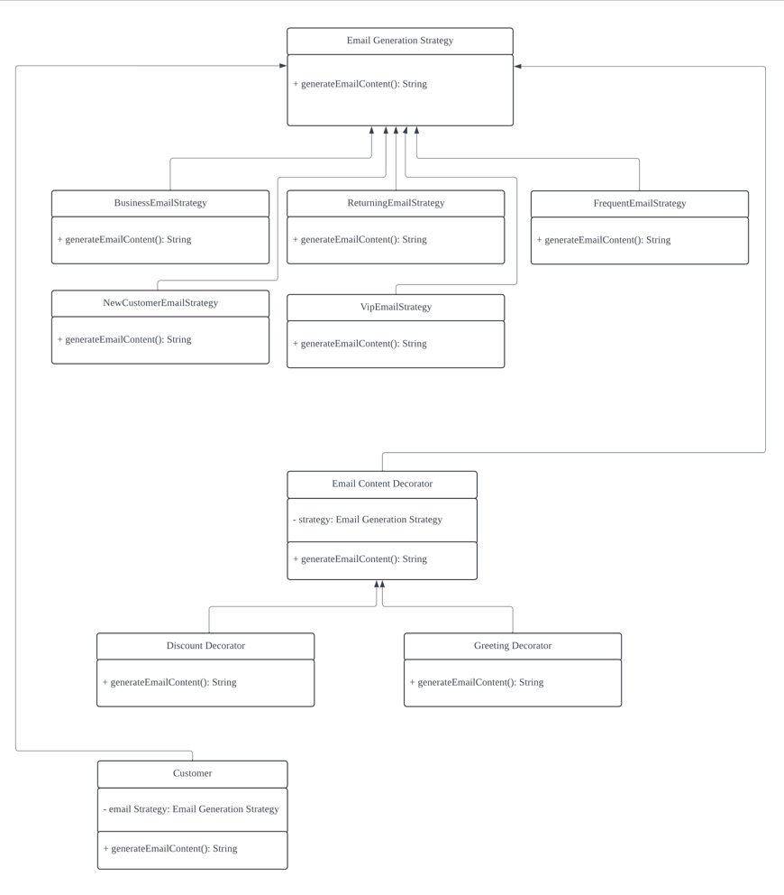

| CS-665       | Software Design & Patterns |
|--------------|----------------------------|
| Name         | Qiong Wang                 |
| Date         | 10/26/2024                 |
| Course       | Fall                       |
| Assignment # | Hw3 Email Generation        |

# Assignment Overview
This project is part of CS-665: Software Designs and Patterns. The objective is to develop an automated email generation system that serves various customer segments, such as Business, Returning, Frequent, New, and VIP customers. The system personalizes emails by generating base content for each segment and then adding optional, customized information like discounts or greetings.

The project requires the implementation of the following components:
1. EmailGenerationStrategy: Represents different strategies for generating base email content based on customer type. 
2. EmailContentDecorator: Allows customization of base email content by adding optional elements such as greetings or discounts. 
3. Customer: Uses an email generation strategy to generate customized emails.

### Key Requirements:
1. Implement separate strategies for different customer types. 
2. Use decorators to apply optional customizations to the base email. 
3. Demonstrate the functionality with unit tests (3-5 JUnit tests). 
4. Apply design patterns such as the Strategy Pattern and Decorator Pattern to enhance flexibility and reusability.

# GitHub Repository Link:
(https://github.com/QiongWang1/CS665_Hw3)


# Implementation Description

This project implements an automated email generation system for different customer segments using Strategy and Decorator Patterns. The system is composed of key components, each responsible for creating and customizing emails according to the customer type and additional preferences.

### Key Components:
1. EmailGenerationStrategy: The interface defines the method generateEmailContent() for generating base email content. Each customer type (e.g., VIP, Returning) has a corresponding strategy that implements this method to create unique content. 
    - **Subclasses**:
      - `BusinessEmailStrategy`, `ReturningEmailStrategy`, `FrequentEmailStrategy`, `NewCustomerEmailStrategy`, `VipEmailStrategy` – each generates content specific to the customer type.
2. EmailContentDecorator: The abstract decorator class that allows additional customization of the email content. Decorators implement the `generateEmailContent()` method to add features such as greetings and discounts.
    - **Subclasses**:
      - `GreetingDecorator`: Adds a personalized greeting to the email content.
      - `DiscountDecorator`: Adds a discount or promotional message to the email.
3. Customer: Represents a customer with a specific email generation strategy. It uses the selected strategy and decorators to produce the final email content.
   - **Methods**:
     - `generateEmailContent()`: Generates the full email content by applying the selected strategy and decorators.

    


### Design Pattern:
The project applies two primary design patterns:
1. Strategy Pattern:
   - Each customer type has a specific strategy for generating the base content, enabling customization without modifying the core system.
2. Decorator Pattern:
   - Decorators provide optional, flexible customization of the base email content, allowing for easy addition of elements like greetings or discounts.

### System Flow:
1. Each `Customer` is assigned an email generation strategy based on their type.
2. The base email content is generated through the assigned strategy.
3. Additional customizations are applied using decorators.
4. The final email content is printed, demonstrating the application of both strategy and decorator patterns.

### Unit Tests:
- **testVipEmailWithGreetingAndDiscount()**: Verifies that VIP emails are generated with both greeting and discount customizations.
- **testNewCustomerEmailWithGreetingOnly()**: Ensures that new customer emails include greetings without additional discounts.
- **testReturningCustomerEmailBaseContent()**: Confirms that the correct base content is generated for returning customers without any decorators.


### Assumptions:
- The email content is structured according to customer type and can be further customized with greetings or discounts.
- Each decorator enhances the email with additional features, and multiple decorators can be applied in sequence.


## Flexibility
This project is designed to be extensible and adaptable:
- **AAdding New Customer Types**: New customer segments can be added by creating additional strategies implementing EmailGenerationStrategy.
- **AAdding New Customizations**: New decorators can be created to add extra customization layers to the email content, such as loyalty program information or special promotions, without changing existing classes.


## Simplicity & Understandability
The system is structured to clearly separate responsibilities, making it straightforward to understand and extend:
- **Single Responsibility**: Each class is responsible for a specific part of the email generation process, adhering to the Single Responsibility Principle (SRP).
- **Reusability**: By using well-known design patterns, the system is flexible and easy to understand, particularly for developers familiar with Strategy and Decorator patterns.


## Avoidance of Duplicated Code
The project follows the DRY (Don't Repeat Yourself) principle to maintain clean, reusable code:
- **Centralized Customization**: The use of decorators centralizes customization logic, avoiding the need for duplicate code in each strategy class.
- **Reusable Components**: Each strategy and decorator class can be reused or extended without needing to duplicate functionality.


## Design Patterns Used
1. Strategy Pattern: Allows the system to select the appropriate email content generator based on customer type.
2. Decorator Pattern: Provides an extensible way to add customized information to the email content, such as discounts or greetings.


### Other Potential Design Patterns:
1. Factory Method: This pattern could be used to create instances of specific customer types or email customizations in future extensions.
2. Template Method: Could be applied if there is a need for a more structured sequence of steps in generating and customizing emails.

# UML Class Diagram
(https://lucid.app/lucidchart/c972a526-08d5-4093-ab95-fa1f1784e4be/edit?invitationId=inv_d218dea2-a83d-4626-81fb-77551dc2eb43)


# Running JUnit Tests

To verify the functionality of the system, JUnit tests have been implemented to test the core components of the project. These tests ensure that the system behaves as expected under various conditions.
### Steps to Run the JUnit Tests:

1. **Compile the Project**:
   First, ensure the project is compiled. You can do this using Maven:
   ```bash
   mvn clean compile

2. **Run Tests**:
   To run the tests, execute the following Maven command:
   ```bash
   mvn test

# Maven Commands

This project uses Maven for building, compiling, and running tests. Below are the essential Maven commands that you can use to manage the project:

### 1. Compile the Project

To compile the project and ensure that the source code is error-free, run the following command:

```bash
mvn clean compile
